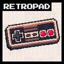

# RetroPad



**Play ReIndev from the sofa.** A pad drives the whole game — walking, looking, mining and
eating — and every menu answers to the d-pad. Crafting gets a console browser in Better Than
Legacy's own skin, sorted so that what you can make right now comes first, and the buttons
tell you what they do with the glyphs of the pad you actually plugged in.

For ReIndev 2.9_03 on FoxLoader 2.0. Client-side only: nothing reaches a server beyond the
ordinary slot clicks any player makes with a mouse.

Xbox (360 / One / Series) and PlayStation (DualShock 3/4, DualSense) pads are recognised by
name; anything else falls back to the Xbox button ordering. Plug one in at any point — the
mod keeps looking, and picks it up without a restart.

## Building

```bash
gradlew build
```

The jar lands in `build/libs/`. Drop it into your instance's `mods/` folder.

`gradlew runClient` launches a development client from `run/`.

### Two things this machine needed

- **`JAVA_TOOL_OPTIONS=-Djdk.net.unixdomain.tmpdir=C:/Users/Administrator/dev/_sock`** —
  JDK 17 builds the NIO pipe behind every `Selector` out of an AF_UNIX socket placed in
  `%TEMP%`, and this machine refuses AF_UNIX sockets in that directory. Without the override
  every Gradle build dies with `Unable to establish loopback connection`.
- **JInput natives for `runClient`** — the dev client unpacks LWJGL's natives but not
  JInput's, so unzip `jinput-platform-2.0.5-natives-windows.jar` into `run/natives/` once.
  Pointing JInput at that folder is handled in code: it reads its own
  `net.java.games.input.librarypath` rather than LWJGL's `org.lwjgl.librarypath`, and the mod
  copies one to the other when only LWJGL's is set. Without the DLLs the log shows an
  `UnsatisfiedLinkError` for `jinput-dx8_64` and no pad is ever found. A real launcher
  instance (Prism, MultiMC) ships the natives itself, so none of this applies there.

## Default controls

| Control | In the world | In menus |
| --- | --- | --- |
| Left stick | move (analog) | move the cursor |
| Right stick | look | scroll a list |
| D-pad | up: chat, down: zoom (hold), left: pick block, right: hide the HUD | jump to the next button, slot or list row |
| A / Cross | jump | select, pick up a stack |
| B / Circle | sneak (hold) | close the screen |
| X / Square | drop the held item | right-click: split a stack, place one |
| Y / Triangle | open inventory | close the inventory; on a screen with a text box, open the keyboard |
| LB / L1, RB / R1 | previous / next hotbar slot | LB opens the crafting menu; RB tidies the chest; inside the crafting menu, LB/RB change category |
| LT / L2 | use item, place block | put the whole backpack into the chest |
| RT / R2 | attack, break block | take everything out of the chest |
| L3 | sprint (hold) | — |
| R3 | change camera | tidy your own items |
| Start | pause menu | close the screen |
| Back / Share | player list (hold) | — |

Actions go through the game's own key bindings, so rebinding *Attack* in the options screen
also rebinds it for the trigger. Only movement and look bypass that, because a keyboard
cannot express half-pressed.

## The crafting menu

It wears Better Than Legacy's own interface — its window graphic, tab strip, cell sprites and
category icons, under CC0-1.0, with the licence text kept beside the textures in
`textures/gui/retropad/`. The layout is quoted from that mod rather than invented: a 273x175
window, eight 35-wide tabs overlapping by a pixel, a strip of recipe cells 18 apart at y=56, the
ingredient grid at (20,109), the result at (103,123), and the player's inventory drawn small at
12 pixels a slot from (152,112). Those numbers came out of its source, and the geometry was
checked against the artwork by rendering it offline before it ever ran.

Any screen with a crafting grid — the player's own inventory, a workbench — gets a **Crafting**
button, and LB opens the same menu from the pad. Recipes are grouped into eight categories; the
d-pad moves the highlight, A crafts the highlighted recipe, B closes the menu.

It is drawn *over* the crafting screen rather than replacing it, and that is not a cosmetic
choice: switching screens runs `GuiContainer.onGuiClosed`, which closes the container on the
server. A workbench would shut the instant the menu opened, and every later slot click would
carry a window id the server no longer knows.

Crafting itself is done by clicking slots — pick a stack up, drop one item into each cell that
needs it, put the remainder back, then shift-click the result. Every one of those is an ordinary
click the server validates like any other, so the menu works in multiplayer and cannot desync
an inventory. If the grid does not produce anything, the ingredients are moved back.

Recipes whose ingredients are computed rather than declared — armour dyeing and similar — are
left out, because there is nothing definite to put in a grid.

## What you feel

JInput reports no motors at all for an XInput pad — `getRumblers()` comes back empty, checked on
the hardware rather than assumed — so the vibration does not go through it. It calls Windows'
own `XInputSetState` through JNA instead, which is why that library is bundled. On a machine
without XInput, or a pad on no port, nothing vibrates and the game carries on.

What is felt, and why each one:

- **Taking damage** — scaled by how much health went. A graze and a fall down a ravine are not
  the same thump. Watched as a drop in the health number, so every source is covered — mobs,
  falling, drowning, poison — with nothing left silent.
- **Landing a hit**, and **a block giving way** — taken from the player controller, so one hook
  covers every mob and every block rather than a list that goes stale.
- **Mining** — a steady tick for as long as the tool is against the block, not one long buzz.
- **Placing a block**, and **eating or drinking** — light, repeated while the trigger is held.
- **Your heartbeat**, from two hearts down. That is the exact point at which the game starts
  shaking the hearts on the HUD, and each point lost below it beats harder and sooner, so the
  last half-heart is a hammering.
- **Being out of breath.** ReIndev already knows when you can no longer sprint; while that
  holds, two heavy pulls, a pause, two more. Low frequency only — a buzz would read as a
  machine rather than a body.

## Typing

A pad cannot reach T, so chat opens an on-screen keyboard with it. Characters are handed to the
screen through `keyTyped`, the same entry point the real keyboard uses, so chat history, command
completion and Enter behave exactly as they do when typed.

Two ways to type, switchable while it is open: a **wheel** — eight groups of five, one group per
stick direction and one button per letter, so a letter is one motion and the hand never travels
— and a **grid** for hunting down a character the wheel does not carry. Latin and Cyrillic both,
because ReIndev's font carries Cyrillic and its chat accepts it — checked in the font table
rather than assumed.

## Tidying

In any container: **RB** sorts the chest, **R3** sorts your own items, **LT** puts the backpack
away, **RT** empties the chest into it. Sorting merges part-full stacks of the same thing and
then walks the rest into order by item.

All of it is the same slot clicks a player makes by hand, sent one at a time, so a full chest
simply stops accepting and nothing is ever destroyed. Depositing leaves the hotbar alone —
sweeping your pickaxe into a chest with the cobble is a favour nobody asks for twice. Armour
slots, crafting grids and the small machines are never touched: a furnace's three slots mean
something individually.

## Settings

`config/retropad.cfg`, or the mod's page in the Mods menu.

| Setting | Default | Notes |
| --- | --- | --- |
| Enable gamepad | on | |
| Controller type | AUTO | force XBOX / PLAYSTATION / GENERIC when detection guesses wrong |
| Device index | -1 | -1 picks the first device that looks like a pad |
| Swap trigger axis | off | see below |
| Stick deadzone | 0.20 | |
| Trigger deadzone | 0.10 | |
| Look sensitivity | 1.6 | |
| Look smoothing | 0.35 | 0 follows the stick instantly, 1 is heavily damped |
| Invert look Y | off | |
| Cursor speed in menus | 1.0 | |
| Show button glyphs | on | the hint bar along the bottom of screens |
| Crosshair pointer | on | hides the system cursor in menus and draws a crosshair instead |
| Debug overlay | off | live stick, button and key-binding state, on the HUD and in screens |
| Console-style inventory | on | reserved for the console inventory work |
| Rumble | on | |
| Rumble strength | 0.85 | scales every effect |
| Hide pointer in menus | on | menus are driven by the highlight; inventories keep their crosshair |
| Step back for the mouse | on | touching the mouse hides the pad interface until the pad is used again |
| Start typing on the wheel | on | off starts the on-screen keyboard on the grid instead |
| Community link | Discord invite | where the title-screen button goes |

## How input reaches the game

Nothing here paints its own cursor or reimplements a screen. The pad moves the real hardware
pointer and writes its buttons into LWJGL's own mouse state, because half the game's widgets —
list rows like the world select screen among them — poll `Mouse.isButtonDown` from inside their
draw method and never see a synthetic click call. That state is re-asserted at the head of every
screen draw, since LWJGL refreshes the button buffer from the OS once per frame and would
otherwise wipe it before the widget looks.

World actions go through the game's own key bindings, written at the head of the game tick
that reads them rather than from the render frame. A binding carries two separate pieces of
state and the game consumes them differently: `pressed`, which a held action needs and which
the tick re-syncs from real hardware, and `pressTime`, a counter that `isPressed()` drains and
that `setKeyBindState` never touches. Every single-shot action — opening the inventory,
dropping an item, opening chat — reads the counter, so synthesising them without bumping it
does nothing at all, silently.

The pointer is the real hardware cursor with the system pointer hidden behind a transparent
hardware cursor, and a crosshair painted at the same spot. Hover, tooltips and list rows keep
working because the game still sees a genuine mouse position. List rows are snap targets like
buttons and slots, because `GuiSlot.selectNextElementUp` and `selectNextElementDown` are empty
methods in ReIndev — a row is only ever chosen by a click landing on it, which is also why the
arrow keys do not work on those lists in the unmodded game.

Overlays are drawn with lighting and depth testing switched off and switched back on afterwards.
`GuiContainer.drawScreen` ends by enabling both, so anything drawn after it — which is where
these overlays go — is lit by a scene with no lights: text disappears and panels come out flat
grey. Ordinary screens leave lighting off, which is why the same overlay looked right in a menu
and wrong in the inventory.

## When something does not respond

Turn on **Debug overlay**. It reports three layers separately — what the driver reports
(stick and trigger values, which buttons are down), what the mod decided (which bindings it is
holding), and what the game's bindings actually contain (`pressed` and `pressTime` for use,
attack and inventory). A fault in any one of them looks identical from the player's chair, and
the overlay is what tells them apart.

## Known limits

These come from JInput, the input library LWJGL 2 ships with, which talks DirectInput on
Windows. Rumble is the one this mod goes around rather than lives with — see below.

- **Xbox pads put both triggers on one axis.** Pressing both at once cancels out, and which
  half is LT differs between driver versions — hence *Swap trigger axis*. PlayStation pads
  report each trigger separately and are unaffected.
- **No hotplug notification.** A pad plugged in mid-session is found by a rescan, which backs
  off from 3 to 8 seconds while nothing is connected. Rescanning needs two caches reset by
  reflection first, and neither is documented: `Controllers.destroy()` compiles to a bare
  `return`, so LWJGL's `created` flag survives and `create()` exits at its first instruction;
  and JInput scans for devices only while its `controllers` field is *null*, so clearing the
  list is not enough.
- **Some pads report a held trigger as an alternating 1, 0, 1, 0** rather than a steady 1 —
  a Flydigi in generic DirectInput mode does. Each 0 reads as "let go", which ends an item's
  use, so the mod holds a trigger's peak reading for 150 ms before believing a lower one. The
  cost is that a trigger releases that much later than it physically did.

Moving to SDL2 (via jamepad) would fix all three at the cost of bundling a native library.

## Credits

- **ReIndev** by silveros, and **FoxLoader** by Fox2Code — the game and the loader this is built
  against.
- **Better Than Legacy (LegacyUI)** — the crafting window, tab strip, cell sprites, category
  icons and button glyphs, under CC0-1.0. The licence text travels with the artwork in
  `src/main/resources/textures/gui/retropad/LICENSE_legacyui.txt`.
- The title-screen button is built from ReIndev's own web-button sheet, recoloured, with a new
  symbol on its face.
- **JNA** (Apache-2.0 / LGPL-2.1) — bundled, and used for one call: `XInputSetState`.

## Licence

Not chosen yet. Until one is added, the usual GitHub default applies — all rights reserved —
which is worth fixing before anyone is invited to contribute.
